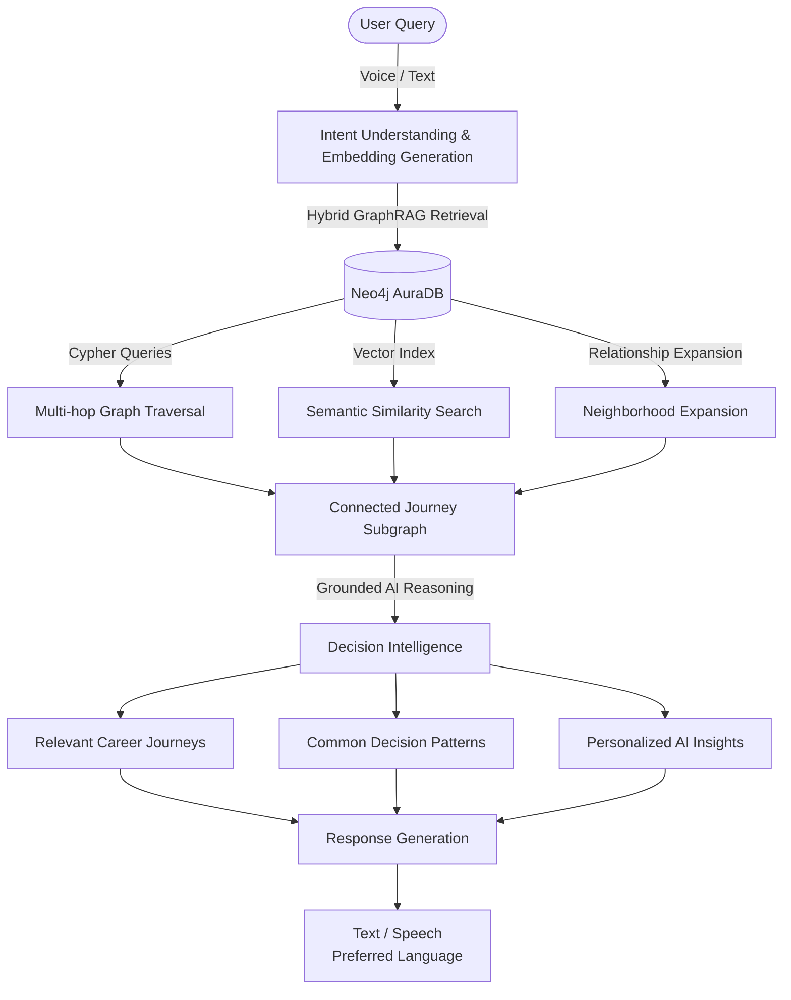
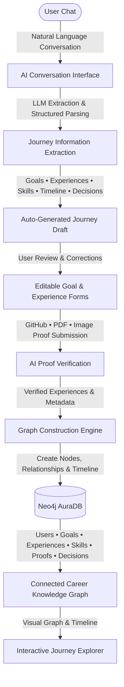

# PathFinder: Search Engine for human experiences

PathFinder makes complete human experiences searchable.

The internet made information searchable; PathFinder makes human career, builder, and life trajectories queryable. People do not struggle today because information is scarce; they struggle because they cannot easily find and verify the pathways of those who were once in their exact situation.

Current search engines answer **"What is this concept?"**
Q&A sites answer **"What do people think?"**
PathFinder answers **"What *actually* happened to people like me?"**

By structuring raw human experience into a verifiable, queryable **Life Graph**, PathFinder enables developers, founders, and students to trace causality, isolate transition patterns, review proof-backed achievements, and query collective human outcomes using first-principles reasoning.

---

## ✦ Live Pitch & Deliverables

* 🎬 **Demo Video (YouTube)**: [Watch the PathFinder Pitch & Walkthrough](https://www.youtube.com/watch?v=cFn0jj-MVC8)
* 📊 **PPT Presentation**: [View Pitch Deck](https://drive.google.com/file/d/1AobVEavMoAPnOungrUzjAT7i7eKRK1ei/view)
* 📝 **Product Blog Post**: [Read on Hashnode/Medium](https://dev.to/mithulcrafts/what-if-we-could-search-human-experiences-instead-of-opinions-33nb)

---

## ✦ The Vision & Problem Space

### The Contextual Deficit
Every year, thousands of individuals attempt complex life changes: transitioning from service-based agencies to product engineering, scaling bootstrapped startups, dropping out of college to build, or breaking into elite research tracks.

When they search for guidance, they encounter fragmented networks:
* **LinkedIn**: A self-promotional, high-level highlight reel that hides setbacks, context, and structural failures.
* **Reddit & Forums**: High-context but highly unstructured threads filled with anonymous opinions rather than verifiable timelines.
* **AI Assistants**: Rephrase generic corporate blueprints but lack access to localized, authentic, and step-by-step human causality.

### The PathFinder Paradigm
PathFinder structures raw narrative into a highly connected **Life Graph** consisting of nodes representing `Education`, `Job`, `Decision`, `Failure`, `Startup`, and `Achievement`. Each node exposes the deep context, raw challenges faced, immediate outcomes, and emotional checkpoints. 

PathFinder doesn't index standalone posts or opinions; it indexes **causal connections and entire trajectories**.

<h2 align="center">Onboarding Architecture</h3>



<h2 align="center">Query Architecture</h2>




---

## ✦ Technical Architecture & Sponsor Integration

PathFinder’s core is built using a highly synergistic stack. Sponsor technologies are not secondary integrations; they are structural architectural pillars:

### 1. Graph Database & Retrieval: Neo4j
* **Purpose**: Trajectory Topology & Causal Querying
* **Integration**: Every journey is modeled as a connected knowledge graph where **Users, Goals, Experiences, Skills, Decisions, Proofs, and Outcomes** are represented as nodes connected through relationships such as `HAS_EXPERIENCE`, `BUILT_SKILL`, `TRANSITION`, `HAS_PROOF`, and `PURSUED_GOAL`. Neo4j powers multi-hop graph traversal, neighborhood expansion, relationship discovery, full-text search, vector search, and GraphRAG retrieval to identify similar career trajectories and decision patterns.
* **Engineering Rationale**: Human journeys are linear over time but branch out causally through decisions. Modeling decisions, pivots, and transitions as database nodes and relationships allows us to traverse pathways with sub-millisecond execution times. Using traditional relational tables or document databases would require recursive, expensive self-joins to find transition patterns.

### 2. Audio Processing: Sarvam AI
* **Purpose**: Voice-to-Text Ingestion & Local Language Translation
* **Integration**: User voice inputs are converted to text using the Sarvam Saaras STT API with `"translate"` mode enabled, allowing regional Indian languages to be parsed directly into English narratives.
* **Engineering Rationale**: People express high-fidelity emotional details, failures, and complex career contexts far more naturally via voice than typing. Sarvam AI ensures that raw regional expressions are captured, translated, and standardized for upstream LLM processing without losing structural nuance.

### 3. Verification & Processing: Gemini & Upstash
* **Purpose**: Structured Information Extraction, Duplicate Prevention, and Workflow Orchestration
* **Integration**:
  * **Gemini (gemini-3.1-flash-lite)** acts as our structured extractor. It parses raw transcripts into strict schemas for Neo4j import.
  * **Upstash Redis** stores onboarding conversation sessions, maintains conversational context across multiple interactions, and caches expensive LLM responses to reduce latency and API usage.
* **Engineering Rationale**: Parsing irregular, conversational human speech into structured JSON is highly complex. Gemini’s native JSON Schema support allows us to extract dates in standard `MM YYYY` formats, categorize emotion labels, and isolate outcomes. Upstash Redis ensures high-performance session state mapping.

### 4. Cross-Platform UI: Expo (React Native)
* **Purpose**: Interactive Flowcharts & Cross-Platform Experience Visualization
* **Integration**: Single TypeScript codebase compiling to Web, iOS, and Android. Integrates a custom Web-fallback alert layer to handle native modal behaviors on the web.
* **Engineering Rationale**: Users need to review their graphs on the fly. Expo allows us to construct a responsive, rich visual canvas using Cytoscape inside webviews, bridging native haptics (`expo-haptics`) and sharing protocols (`expo-sharing`) cleanly with standard web targets.

---

## ✦ Market Opportunity & Future Scope

### The Verified Pedigree Market (B2B Recruiting & Talent Acquisition)
Traditional background screening is a slow, centralized, and expensive process. Resumes are highly falsified and LinkedIn profiles are unchecked. PathFinder disrupts this $20B recruitment and background verification market by introducing:
* **The "Proof-of-Experience" Graph**: Instead of static CV text, candidates present a Neo4j trajectory with verified evidence (e.g. proof-backed outcomes, github logs, verified certifications).
* **Targeted Predictive Hiring**: Companies query exact transition pathways (e.g., *"Show me engineers who have successfully migrated legacy architectures to microservices inside startups"*), matching candidates based on real verified outcomes rather than vanity college credentials.

### Future Product Roadmap
1. **AI Pathway Simulation**: Allow users to model future choices (e.g., *"If I pursue a Master's abroad vs. bootstrapping a SaaS, what does the graph suggest my likelihood of reaching 50 LPA is, based on historical user nodes?"*).
2. **Decentralized Verification Protocol**: Move verification certificates and proof logs onto decentralized chains to issue cryptographically signed, immutable career milestone achievements.
3. **Automated Mentorship Matching**: Connect users whose current *Goal* matches the exact *Achievement* node of a senior verified user in the same career vector.

---

## ✦ Bonus Tasks & Requirements

- [✅] **All team members followed official social channels and submitted the form** (mandatory)
- [✅] **Bonus Task 1** – Shared our hackathon badges and filed the form (2 points)
- [✅] **Bonus Task 2** – Write a blog (3 points)

---

## ✦ Monorepo Layout

```
.
├── backend/            # Express.js API, Graph Traversal Engine & AI Processors
│   ├── src/
│   │   ├── ai/         # AI Providers (Gemini, Groq, Sarvam)
│   │   ├── controllers/# Route Request Handlers
│   │   ├── db/         # Seed data & graph schema migrations
│   │   ├── processors/ # Zod validation schemas & JSON extraction processors
│   │   ├── routes/     # API Route Definitions
│   │   └── services/   # Neo4j connections & Upstash Redis integrations
│   └── package.json
│
├── frontend/           # Expo React Native App (iOS, Android, Web)
│   ├── app/            # Expo Router file-based screens
│   ├── api/            # Server endpoints call wrappers
│   ├── components/     # UI Design System & Landing Page modules
│   └── package.json
│
└── docs/               # Deep-dive system documentation
    ├── architecture.md # Complete system architecture blueprint
    ├── how-it-works.md # Step-by-step lifecycle flow
    └── setup.md        # Environment setup & local run guides
```

---

## ✦ Getting Started

Read the following deep-dive manuals to understand, build, and deploy PathFinder:

* **[Architecture Guide](docs/architecture.md)**: Explore our Neo4j schema, AI ingestion pipeline, and caching layer design.
* **[Product Lifecycle Guide](docs/how-it-works.md)**: Follow a journey from voice recording to verification and query retrieval.
* **[Local Setup Manual](docs/setup.md)**: Follow the step-by-step instructions to configure variables, migrate databases, and run the monorepo locally.

---

## ✦ The PathFinder Ecosystem

| Technology | Role | Alternative Considered | Trade-off / Rationale |
| :--- | :--- | :--- | :--- |
| **Neo4j** | Graph Storage & Traversal | PostgreSQL with recursive CTEs | Neo4j native index-free adjacency traverses multi-degree relationships in $O(1)$ constant time compared to complex $O(\log N)$ database joins. |
| **Expo** | Mobile & Web Frontend | Native Swift/Kotlin | Expo Router and React Native Web provide a unified codebase, reducing UI divergence. |
| **Gemini 3.1** | JSON Trajectory Extraction | Llama-3-70B on Groq | Gemini 3.1 Flash-Lite offers superior structured output validation and larger context windows for long, complex verbal histories. |
| **Clerk** | JWT Authentication | Custom Express Sessions | Clerk handles token synchronization across React Native Native, Web, and Express middlewares. |
| **Upstash Redis** | Vector Index Caching & Rates | Local Redis Instance | Serverless Upstash instances reduce operational complexity and automatically scale on demand during hackathon peaks. |
| **Cloudinary** | Proof Asset Storage | Local File Storage | Cloudinary generates optimized thumbnails and secure CDN delivery URLs for images and PDFs submitted as verification evidence. |

---
*Built with passion for HackHazards 2026.*
