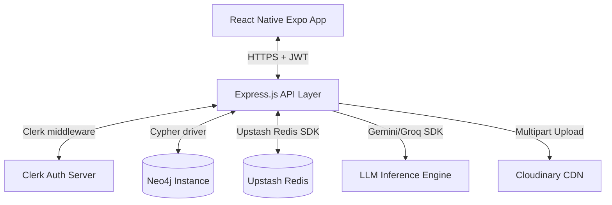
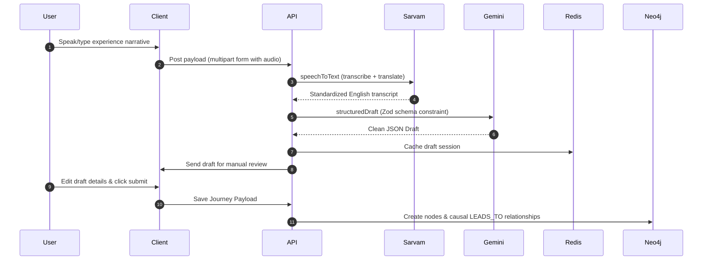

# Technical Architecture Blueprint

This document details the software architecture, database design, AI orchestration pipelines, and security layers of PathFinder.

---

## ✦ System Topology Overview

PathFinder is built as a modular monorepo consisting of a React Native (Expo) client and an Express.js (TypeScript) API backend. Data persistence is split between Neo4j (graph database modeling life event causality) and Upstash Redis (caching, rate limiting, and session control).



---

## ✦ System Components

### 1. Ingestion & Structured Parsing
* **Technology**: Sarvam AI + Gemini 3.1 Flash-Lite + Upstash Workflow
* **Function**: Ingests raw voice inputs or text summaries. Sarvam AI translates regional Indian language speeches to English. Gemini structures the text into a strict JSON payload mapping `experiences`, `goals`, and `proofs`. Upstash Workflow orchestrates the multi-step verification process asynchronously.

### 2. Knowledge Graph: Neo4j
* **Technology**: Neo4j Graph DB
* **Function**: Maps trajectories. Nodes represent `User`, `Experience`, `Goal`, and `Skill`. causal relationships are modeled using `LEADS_TO` and `ASSOCIATED_WITH`.
* **Cypher Schema**:
```cypher
(:User {clerkId, username})
  -[:HAS_EXPERIENCE]-> (:Experience {id, title, context, outcome, startDate, endDate})
  -[:LEADS_TO]-> (:Experience)
(:Experience) -[:ASSOCIATED_WITH]-> (:Goal {id, title, description, status, topic, subtopics})
(:Experience) -[:ACQUIRED_SKILL]-> (:Skill {name, type})
(:Experience) -[:HAS_PROOF]-> (:Proof {id, sourceType, url})
```

### 3. Vector Embedding & Retrieval
* **Technology**: Xenova Transformers (`all-MiniLM-L6-v2`) on the API layer + Upstash Vector Caching
* **Function**: Generates embeddings of incoming user queries to match them against nodes in the graph database. Cypher queries filter by topic/subtopic categories, followed by vector cosine similarity matching to return the most relevant trajectories.

### 4. Verification & Community Proof Layer
* **Technology**: Clerk JWT + Cloudinary Secure Asset Storage
* **Function**: Users upload PDFs or images proving their achievements (e.g. GitHub repos, certificate URLs, transcripts). Files are stored on Cloudinary. Every node's verification status is dynamically tracked (`PENDING`, `VERIFIED`, `REJECTED`). The community can view graphs publicly and upvote helpful trajectories.

---

## ✦ AI Orchestration & Reasoning Pipeline

PathFinder does not treat LLMs as simple chat engines. They act as compiler layers transforming unstructured speech into highly typed graph structures.



### Ingestion Pipeline Steps
1. **Transcribe & Translate (Sarvam AI)**: When voice queries or records are submitted, Sarvam's `Saaras:v3` transcribes speech. If the audio is in regional languages, the `"translate"` option automatically maps the text to standardized English.
2. **Entity & Relation Extraction (Gemini 3.1)**: Gemini extracts nodes (`Experience`, `Goal`, `Skill`) and maps relations. Strict validation is enforced using Zod schemas (`submitGoalSchema`, `journeyDraftSchema`).
3. **Static Analysis & Duplicate Prevention**: Before saving, similar experiences are validated against historical nodes. The system flags duplicates using vector embedding similarity thresholds.
4. **Neo4j Transaction Execution**: A transactional Cypher query commits all nodes, updating the interactive web view.

---

## ✦ Graph Traversal & Query Reasoning

When a user asks:
*"Show me the exact steps service-based company developers took to prepare for system design rounds at product tech companies..."*

PathFinder executes a hybrid traversal pipeline:
1. **Vector Query Expansion**: The query is converted into a vector embedding. We query the graph for nodes with similar semantic context.
2. **Structural Cypher Traversal**: We search for paths where a user transitioned from a non-tech/service-based role to a product company:
   ```cypher
   MATCH (u:User)-[:HAS_EXPERIENCE]->(e1:Experience)-[:LEADS_TO]->(e2:Experience)
   WHERE e1.title CONTAINS 'Service' AND e2.title CONTAINS 'Product'
   MATCH (e2)-[:ASSOCIATED_WITH]->(g:Goal)
   RETURN u.username, e1.title, e2.title, g.title, g.description
   ```
3. **Context Aggregation & LLM Synthesis (Groq / Llama-3)**: The traversed trajectories are fed as structured facts to Llama-3 on Groq, which synthesizes a step-by-step verified blueprint showing concrete outcomes instead of generic advice.

---

## ✦ Technology Rationale & Trade-offs

### Neo4j
* **Why chosen**: Causal path traversal. Querying deep degrees of relationship (e.g. finding 3rd-degree transitions) requires complex joins in SQL, which degrade performance. Neo4j's index-free adjacency traverses these in constant time.
* **Trade-off**: Requires running and maintaining a separate graph database cluster. We mitigated this by utilizing Neo4j Aura Serverless.

### Sarvam AI
* **Why chosen**: India-first speech translation. Standard STT engines fail on code-mixed languages (Hinglish, Telglish) or regional dialects. Sarvam AI handles local dialects natively.
* **Trade-off**: Higher latency compared to OpenAI Whisper. We resolved this by introducing asynchronous Upstash Workflows for processing large files.

### Upstash Redis
* **Why chosen**: Serverless database connection limits. Serverless environments scale up fast, which can exhaust connection pools on traditional Redis clusters. Upstash handles pooling natively over HTTP.
* **Trade-off**: HTTP requests introduce slightly more latency (2-5ms) than persistent TCP connections. However, this is negligible for our ingestion/caching layer.

### Gemini 3.1 Flash-Lite
* **Why chosen**: Schema enforcement and low cost. Gemini's support for native structured schema definitions ensures Zod compliance without complex retry loops.
* **Trade-off**: Lower reasoning capabilities than Gemini Ultra. We mitigated this by using Llama-3-70B on Groq for synthesising the final complex query reasoning.
