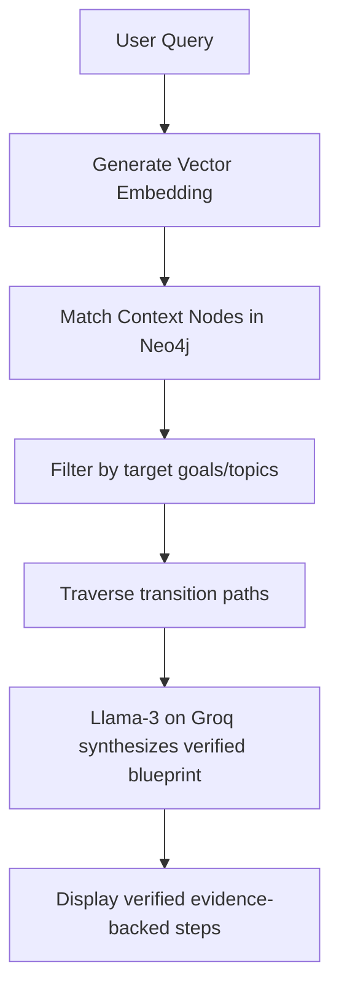

# How PathFinder Works: Step-by-Step Lifecycle

This guide walks through the lifecycle of a user journey on PathFinder—from initial voice onboarding to knowledge graph extraction, verification, querying, and community upvoting.

---

## 1. User Onboarding & Auth
1. **Authentication (Clerk)**: The user signs up/in securely using Google OAuth or email.
2. **Session Initialization**: The Express backend initializes a new User node in Neo4j if it is their first login:
   ```cypher
   MERGE (u:User {clerkId: $clerkId})
   ON CREATE SET u.username = $username, u.email = $email
   ```

---

## 2. Ingesting & Transcribing Narratives
Users click **"Share Journey"** and record their voice or enter text describing their professional history.

```
"I worked at TCS for 2 years as a system engineer. I wanted to transition to product companies. I spent 4 months practicing system design and building a distributed cluster error tracker. Finally, I cleared interviews at Vercel and got a job as a senior platform developer."
```

* **Voice Processing**: If recorded, the raw audio file (M4A/WAV) is sent to `/api/query/voice` or `/api/journey/draft/voice`.
* **Sarvam Translation**: Sarvam AI translates regional phrases (e.g. Hinglish: *"Maine system design prepare kiya"*) to standard English text.

---

## 3. Journey Draft Generation (The Compilation Phase)
The transcribed text is sent to the **Gemini 3.1 Structured Extractor**.

* **AI Extraction**: Gemini analyzes the transcript and outputs a structured draft JSON conforming to `journeyDraftSchema`:
  ```json
  {
    "experiences": [
      {
        "title": "System Engineer at TCS",
        "context": "Worked in service delivery and legacy frameworks.",
        "outcome": "Learned scaling basics but lacked product experience.",
        "startDate": "06 2021",
        "endDate": "06 2023",
        "skills": [{"name": "Java", "type": "Technical"}]
      },
      {
        "title": "Senior Platform Developer at Vercel",
        "context": "Upskilled in system design and built an error tracker.",
        "outcome": "Cleared frontend/platform interviews successfully.",
        "startDate": "10 2023",
        "endDate": null,
        "skills": [{"name": "System Design", "type": "Technical"}]
      }
    ]
  }
  ```
* **Draft Verification UI**: The extracted draft is sent to the client. The user reviews the experience cards inside the Expo App form, modifies dates, associates goals, and adds verification links.

---

## 4. Graph Construction (The Neo4j Write Phase)
Once the user clicks **"Save Journey"**, the payload is committed to Neo4j.

* **Causal Linkage**: The backend binds experiences sequentially using `LEADS_TO` edges to preserve chronological causality:
  ```cypher
  MATCH (u:User {clerkId: $clerkId})
  CREATE (e1:Experience {title: "System Engineer at TCS"})
  CREATE (e2:Experience {title: "Senior Platform Developer at Vercel"})
  CREATE (u)-[:HAS_EXPERIENCE]->(e1)
  CREATE (e1)-[:LEADS_TO]->(e2)
  ```
* **Associated Goals**: Goals (like *"Prepare for system design"* or *"Build error tracker"*) are linked to experiences using the `ASSOCIATED_WITH` relationship.
* **Proof Binding**: Proof objects (such as GitHub repositories or Cloudinary-stored PDFs) are created and attached:
  ```cypher
  CREATE (e2)-[:HAS_PROOF]->(:Proof {id: $proofId, sourceType: "github", url: "github.com/..."})
  ```

---

## 5. Trajectory Querying & Hybrid Search (The Read Phase)
A developer queries the system: *"How do I prepare for platform engineer roles at product companies?"*



1. **Semantic Search**: The system converts the query into a vector embedding and queries the database for matching experiences and goals.
2. **Causal Graph Search**: The system traverses the network to find users who successfully transitioned:
   - Starts at experiences matching "System Engineer"
   - Follows `LEADS_TO` edges
   - Arrives at target experiences matching "Platform Developer" or "Vercel"
3. **Evidence Extraction**: The traversal extracts the goals, challenges, outcomes, and secure proof links (e.g. the specific GitHub repo created to prove skills).
4. **AI Reasoning Synthesis**: Groq Llama-3-70B synthesizes these items into a verifiable path:
   ```
   "Here is the verified path taken by users who transitioned:
   1. Upskilled in System Design (Goal ID: 916e).
   2. Built a 'distributed cluster error tracker' (Verified GitHub Repo: github.com/user/tracker).
   3. Applied for Senior Platform roles."
   ```

---

## 6. Community Validation & Feed
* **Upvoting**: Helpful journeys appear on the community feed. Developers can upvote individual experiences:
  ```cypher
  MATCH (u:User {clerkId: $clerkId}), (e:Experience {id: $expId})
  MERGE (u)-[:UPVOTED]->(e)
  ```
* **Interactive Exploration**: Users can open any public profile to interact with the Cytoscape graph canvas, click on nodes to inspect verification files, and download the graph as an image.
