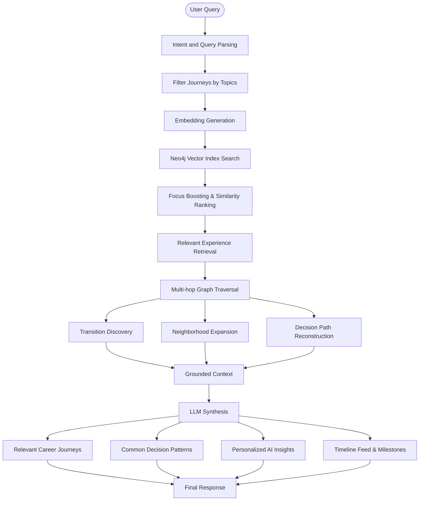

# How PathFinder Works: Step-by-Step Lifecycle

This guide walks through the lifecycle of a user journey on PathFinder—from initial voice onboarding to knowledge graph extraction, verification, querying, and community upvoting.

---

## 1. User Onboarding & Auth
1. **Authentication (Clerk)**: The user signs up/in securely using Google OAuth or email.
2. **Session Initialization**: The Express backend initializes a new User node in Neo4j if it is their first login:
   ```cypher
   MERGE (u:User {clerkId: $clerkId})
   ON CREATE SET u.username = $username, u.email = $email
   ```

---

## 2. Conversational Journey Onboarding

Users begin onboarding through a conversational AI interface instead of filling long forms manually. The chatbot asks guided questions about their career or entrepreneurial journey, including goals, experiences, challenges, decisions, and outcomes.
```
"I started as a System Engineer at TCS, but I wanted to move into product engineering. Over the next four months I focused on system design, built a distributed error tracking platform, and eventually secured a backend role at Vercel."
```
* **Conversational Context**: Each user response is stored as part of the onboarding session, allowing the AI to ask follow-up questions and gather missing details such as timelines, organizations, skills, and outcomes.
* **Session Persistence**: The conversation state is maintained in **Upstash Redis**, enabling users to continue onboarding across multiple interactions without losing context.

---

## 3. Journey Draft Generation (The Compilation Phase)
The transcribed text is sent to the **Gemini 3.1 Structured Extractor**.

* **AI Extraction**: Gemini analyzes the transcript and outputs a structured draft JSON conforming to `journeyDraftSchema`:
  ```json
  {
    "experiences": [
      {
        "title": "System Engineer at TCS",
        "context": "Worked in service delivery and legacy frameworks.",
        "outcome": "Learned scaling basics but lacked product experience.",
        "startDate": "06 2021",
        "endDate": "06 2023",
        "skills": [{"name": "Java", "type": "Technical"}]
      },
      {
        "title": "Senior Platform Developer at Vercel",
        "context": "Upskilled in system design and built an error tracker.",
        "outcome": "Cleared frontend/platform interviews successfully.",
        "startDate": "10 2023",
        "endDate": null,
        "skills": [{"name": "System Design", "type": "Technical"}]
      }
    ]
  }
  ```
* **Draft Verification UI**: The extracted draft is sent to the client. The user reviews the experience cards inside the Expo App form, modifies dates, associates goals, and adds verification links.
* **Editable Journey Forms**: The generated draft is automatically populated into Goal and Experience forms inside the Expo application. Users can review, modify, or enrich the extracted information before submission.
* **Proof Attachment**: Users can attach GitHub repositories, PDFs, or images to each experience. These proofs are later verified before the journey is persisted in Neo4j AuraDB.

---

## 4. Graph Construction (The Neo4j Write Phase)
Once the user reviews the generated draft and submits it, the backend validates the data, verifies attached proofs, and persists the journey as a connected knowledge graph in Neo4j AuraDB.

* **Graph Construction**: Users, Goals, Experiences, Skills, Proofs, and Decisions are stored as independent nodes connected through typed relationships such as `HAS_EXPERIENCE`, `PURSUED_GOAL`, `BUILT_SKILL`, `HAS_PROOF`, and `TRANSITION`.

  ```cypher
  MATCH (u:User {clerkId: $clerkId})

  CREATE (e:Experience {
    id: $experienceId,
    title: $title,
    context: $context
  })

  CREATE (g:Goal {id: $goalId})

  CREATE (u)-[:HAS_EXPERIENCE]->(e)
  CREATE (e)-[:PURSUED_GOAL]->(g)
  ```

* **Decision Transitions**: Rather than relying solely on chronological ordering, the backend infers meaningful transitions between experiences. Each transition captures the decision that caused the career move and is stored as a `TRANSITION` relationship.

  ```cypher
  MATCH (e1:Experience {id: $fromId})
  MATCH (e2:Experience {id: $toId})

  CREATE (e1)-[:TRANSITION {
    decisionLabel: "Focused on System Design"
  }]->(e2)
  ```

* **Proof Binding**: Verified GitHub repositories, PDFs, and images are stored as `Proof` nodes and attached to their corresponding experiences.

  ```cypher
  MATCH (e:Experience {id: $experienceId})

  CREATE (p:Proof {
    id: $proofId,
    sourceType: "github",
    url: $url,
    status: "verified"
  })

  CREATE (e)-[:HAS_PROOF]->(p)
  ```

---

## 5. Trajectory Querying & Hybrid Search (The Read Phase)
A developer queries the system: *"How do I prepare for platform engineer roles at product companies?"*



1. **Intent Understanding & Retrieval**: The query is analyzed to identify the user's intent, relevant topics, subtopics, and focus preferences. A vector embedding is generated and used to retrieve semantically similar experiences from Neo4j's vector index.
2. **Graph Expansion & Traversal**: Starting from the retrieved experiences, the graph is expanded using multi-hop traversal, neighborhood expansion, and transition discovery to uncover connected goals, skills, decisions, proofs, and related career trajectories.
3. **Context Assembly**: Retrieved journeys are ranked and merged into a grounded context containing verified experiences, decision paths, common transition patterns, supporting proofs, and timeline information.
4. **AI Reasoning & Response Generation**: The grounded context is synthesized by the LLM to produce an evidence-backed response containing:
   - Relevant career journeys
   - Common decision patterns
   - Personalized AI insights
   - Timeline of key milestones
   - Links to verified supporting proofs

---

## 6. Community Validation & Feed
* **Upvoting**: Helpful journeys appear on the community feed. Developers can upvote individual experiences:
  ```cypher
  MATCH (u:User {clerkId: $clerkId}), (e:Experience {id: $expId})
  MERGE (u)-[:UPVOTED]->(e)
  ```
* **Interactive Exploration**: Users can open any public profile to interact with the Cytoscape graph canvas, click on nodes to inspect verification files, and download the graph as an image.
